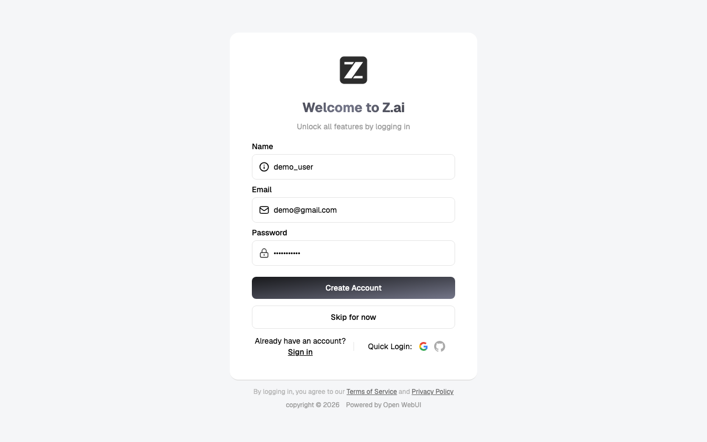
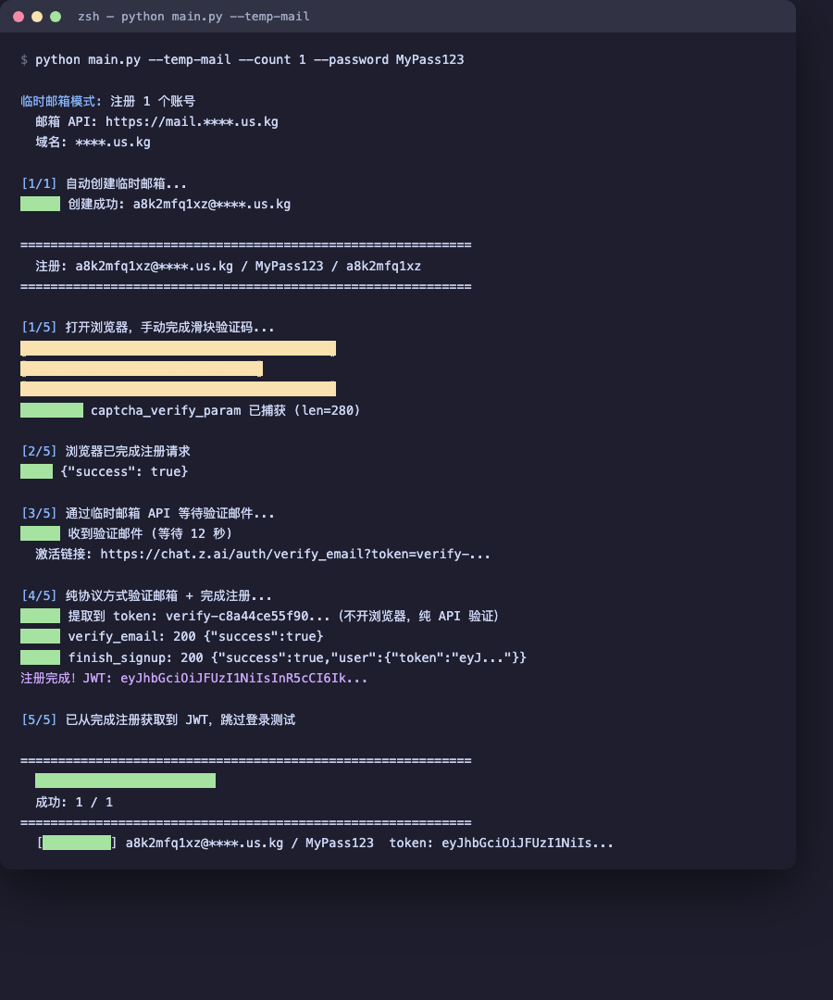

<div align="center">

# ZAI-Register

**z.ai 账号批量注册工具** — Playwright 手动滑块 + 全自动 API 注册 + 纯协议邮箱验证

[](https://www.python.org/)
[](https://playwright.dev/python/)
[]()
[]()

</div>

---

## 截图

**注册页 — 手动拖动滑块（唯一需要人工的步骤）**



**运行流程 — 全自动完成注册、收邮件、协议验证**



## 特性

- **临时邮箱全自动注册** — 自动创建临时邮箱地址，无需自备邮箱
- **纯协议邮箱验证** — 验证邮件收到后直接走 API 提取 token 完成激活，不开浏览器、不弹窗
- **滑块人工兜底** — 阿里云滑块验证码由人工在浏览器中拖动完成，脚本自动拦截 `captcha_verify_param`
- **三种邮箱模式** — 临时邮箱 API / IMAP / 跳过验证
- **批量注册** — 自动限流间隔（65 秒/账号），结果导出 `accounts.json` + `accounts.txt`
- **跨平台** — Windows / macOS / Linux 均可运行，浏览器窗口自动置前

## 注册流程

```
┌──────────────┐   ┌─────────────┐   ┌──────────────┐   ┌──────────────┐   ┌─────────────┐
│ 0.创建临时邮箱 │   │ 1.浏览器滑块  │   │ 2.API 注册    │   │ 3.收验证邮件   │   │ 4.纯协议验证  │
│ (temp-mail)  │──▶│ (手动)       │──▶│ /auths/signup│──▶│ (API 轮询)   │──▶│ verify_email│
│ new_address  │   │ 拦截 captcha │   │              │   │ parsed_mails │   │ finish_signup│
│ → JWT        │   │             │   │              │   │ → token      │   │ → JWT 直出   │
└──────────────┘   └─────────────┘   └──────────────┘   └──────────────┘   └─────────────┘
```

1. **创建临时邮箱**：`POST /api/new_address` → 拿到邮箱地址 + JWT
2. **滑块验证码**：弹出 Chromium 窗口自动填表，人工拖动滑块，脚本拦截 `captcha_verify_param`
3. **API 注册**：`POST /api/v1/auths/signup`，携带拦截到的 captcha token
4. **收验证邮件**：临时邮箱 API 轮询 `GET /api/parsed_mails`，提取激活链接
5. **纯协议验证**：从链接提取 token → `verify_email` → `finish_signup` → 直接拿到登录 JWT（失败自动回退浏览器激活）

## 快速开始

### 1. 安装

```bash
pip install -r requirements.txt
python -m playwright install chromium
```

<details>
<summary>Windows 一键安装</summary>

双击 `install.bat` 即可。
</details>

### 2. 配置临时邮箱

本项目对接开源项目 [dreamhunter2333/cloudflare_temp_email](https://github.com/dreamhunter2333/cloudflare_temp_email)（Cloudflare Workers 免费自部署临时邮箱系统）。部署好后编辑 `zai/config.py`：

```python
PROXY = "http://127.0.0.1:7897"       # 代理地址（留空不走代理）

MAIL_API_BASE = "https://mail.yourdomain.com"   # 你的临时邮箱 API 地址
MAIL_SITE_PASSWORD = "your-site-password"       # 站点密码
MAIL_DOMAIN = "yourdomain.com"                  # 邮箱域名
```

> 也可以不改配置文件，运行时用 `--mail-base` / `--mail-pass` / `--mail-domain` 参数覆盖。

### 3. 运行

```bash
# 临时邮箱全自动模式（推荐）
python main.py --temp-mail --count 5 --password MyPass123

# 指定邮箱注册
python main.py --email user@example.com --password MyPass123

# 批量注册（emails.txt 每行一个邮箱）
python main.py --batch emails.txt --password MyPass123

# 指定代理
python main.py --temp-mail --count 3 --proxy http://127.0.0.1:7897

# 跳过邮箱验证
python main.py --email user@example.com --no-email
```

### 4. 结果

运行结束后生成两个文件：

| 文件 | 内容 |
|------|------|
| `accounts.json` | 完整注册结果（含 JWT token） |
| `accounts.txt` | 精简账号列表：`邮箱 \| 密码 \| 状态 \| token` |

## 参数说明

| 参数 | 说明 | 默认值 |
|------|------|--------|
| `--temp-mail` | 使用临时邮箱 API 自动创建邮箱 | False |
| `--count N` | 临时邮箱模式注册数量 | 1 |
| `--mail-base` | 临时邮箱 API 地址 | config.py |
| `--mail-pass` | 临时邮箱站点密码 | config.py |
| `--mail-domain` | 临时邮箱域名 | config.py |
| `--email` | 单个注册邮箱 | - |
| `--batch` | 批量注册文件 | - |
| `--password` | 密码 | 邮箱地址 |
| `--name` | 用户名 | 邮箱前缀 |
| `--proxy` | HTTP 代理 | config.py |
| `--imap-host` | IMAP 服务器 | config.py |
| `--imap-pass` | 邮箱密码/授权码 | config.py |
| `--no-email` | 跳过邮箱验证 | False |
| `--output` | 结果输出文件 | `accounts.json` |

## 邮箱验证模式

| 模式 | 命令 | 说明 |
|------|------|------|
| 临时邮箱 API | `--temp-mail` | 全自动，自动创建邮箱并收信 |
| IMAP | `--imap-host ...` | 传统方式，通过 IMAP 读取验证邮件 |
| 跳过 | `--no-email` | 注册后手动点验证链接 |

## 项目结构

```
zai-register/
├── main.py              # 命令行入口
├── requirements.txt     # Python 依赖
├── install.bat          # Windows 一键安装
├── run.bat              # Windows 一键运行
├── docs/                # 截图
├── accounts.json        # 注册结果（运行后生成）
└── zai/
    ├── config.py         # 配置（代理/邮箱/密码）
    ├── api.py            # z.ai API 客户端
    ├── captcha.py        # Playwright 滑块模块（Windows/macOS 窗口置前）
    ├── email_api.py      # 临时邮箱 API 客户端
    ├── email_verify.py   # IMAP 邮箱验证（备用）
    └── register.py       # 注册流程编排（含纯协议验证）
```

## 注意事项

- z.ai 按邮箱限流 60 秒，批量注册自动间隔 65 秒
- 滑块验证码必须手动完成，脚本不自动过滑块
- 国内网络需要代理才能访问 z.ai
- 批量注册时每个账号会弹出一次浏览器窗口拖滑块
- 邮箱验证已协议化，不弹浏览器；协议失败自动回退浏览器激活

## 免责声明

本项目仅供学习和技术研究，请勿用于任何违反法律法规或目标网站服务条款的用途。使用本项目产生的一切后果由使用者自行承担。

## License

MIT
